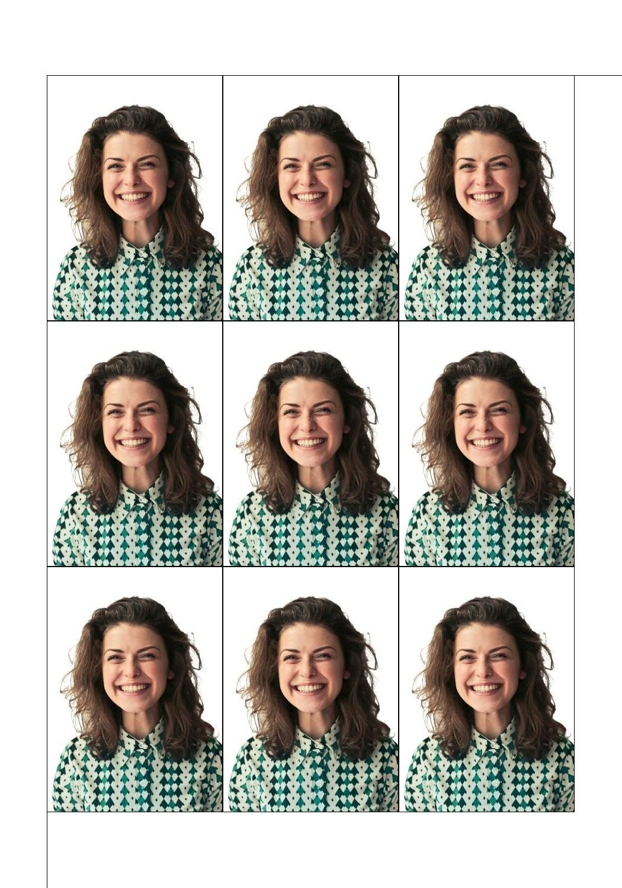

# LiYing

[简体中文](./README.md) | English

LiYing is an automated photo processing program designed for automating general post-processing workflows in photo studios.

## Introduction

LiYing can automatically identify human bodies and faces, correct angles, change background colors, crop passport photos to any size, and automatically arrange them.

LiYing can run completely offline. All image processing operations are performed locally.

### Simple Workflow Description


### Demonstration

|  |  |  |
| ----------------------------- | ---------------------------- | ---------------------------- |
| (1-inch on 5-inch photo paper - 3x3) | (2-inch on 5-inch photo paper - 2x2) | (1-inch on 6-inch photo paper - 4x2) |

**Note: This project is specifically for processing passport photos and may not work perfectly on any arbitrary image. The input images should be standard single-person portrait photos.**

**It is normal for unexpected results to occur if you use complex images to create passport photos.**

## Getting Started

### Bundled Package

If you are a Windows user and do not need to review the code, you can [download the bundled package](https://github.com/aoguai/LiYing/releases/latest) (tested on Windows 7 SP1 & Windows 10). Extract it and drag your images or directory into `run.bat` to start LiYing.

### Setup and Installation

You can install and configure LiYing locally by following the instructions below.

#### Prerequisites

LiYing depends on AGPicCompress, which in turn requires `mozjpeg` and `pngquant`.

You may need to manually install `pngquant`. Refer to the [official pngquant documentation](https://pngquant.org/) and add it to the appropriate location.

LiYing checks for `pngquant` in the following locations, which you can configure:
- Environment variables (recommended)
- LiYing/src directory
- `ext` directory under LiYing/src

This allows AGPicCompress to locate and use `pngquant` for PNG image compression.

##### Microsoft Visual C++ Redistributable Dependency

You need to install the latest [Microsoft Visual C++ Redistributable](https://learn.microsoft.com/en-us/cpp/windows/latest-supported-vc-redist).

If you are using Windows, your minimum version should be Windows 7 SP1 or higher.

#### Building from Source

You can obtain the LiYing project code by running:

```shell
git clone https://github.com/aoguai/LiYing
cd LiYing ## Enter the LiYing directory
pip install -r requirements.txt # Install Python helpers' dependencies
```

**Note: If you are using Windows 7, ensure you have at least Windows 7 SP1 and `onnxruntime==1.14.0`.**

#### Downloading the Required Models

Download the models used by the project and place them in `LiYing/src/model`, or specify the model paths in the command line.

| Purpose                   | Model Name        | Download Link                                                                                                         | Source                                                  |
|---------------------------|-------------------|----------------------------------------------------------------------------------------------------------------------|---------------------------------------------------------|
| Face Recognition          | Yunnet            | [Download Link](https://github.com/opencv/opencv_zoo/blob/main/models/face_detection_yunet/face_detection_yunet_2023mar.onnx) | [Yunnet](https://github.com/ShiqiYu/libfacedetection)  |
| Subject Recognition and Background Replacement | RMBG-1.4         | [Download Link](https://huggingface.co/briaai/RMBG-1.4/blob/main/onnx/model.onnx)                                           | [RMBG-1.4](https://huggingface.co/briaai/RMBG-1.4)     |
| Body Recognition          | yolov8n-pose      | [Download Link](https://github.com/ultralytics/assets/releases/download/v8.2.0/yolov8n-pose.pt)                           | [ultralytics](https://github.com/ultralytics/ultralytics) |

**Note: For the yolov8n-pose model, you need to export it to an ONNX model. Refer to the [official documentation](https://docs.ultralytics.com/integrations/onnx/) for instructions.**

#### Running

```shell
cd LiYing/src
python main.py --help
```

For Windows users, the project provides a batch script for convenience:

```shell
cd LiYing
run_en.bat ./images/test1.jpg
```

#### CLI Parameters and Help

```shell
python main.py --help
Usage: main.py [OPTIONS] IMG_PATH

  Image Processing CLI Tools

  IMG_PATH: Input Image Path

Options:
  -y, --yolov8-model-path PATH    Path to YOLOv8 model
  -u, --yunet-model-path PATH     Path to YuNet model
  -r, --rmbg-model-path PATH      Path to RMBG model
  -b, --bgr-list BGR_LIST         BGR channel values list (comma-separated)
                                  for image composition
  -s, --save-path PATH            Path to save the output image
  -p, --photo-type TEXT           Type of photo
  --photo-sheet-size [5|6]        Size of the photo sheet (5-inch or 6-inch)
  -c, --compress / --no-compress  Whether to compress the image
  -sc, --save-corrected / --no-save-corrected
                                  Whether to save the corrected image
  -bg, --change-background / --no-change-background
                                  Whether to change the background
  -sb, --save-background / --no-save-background
                                  Whether to save the image with changed
                                  background
  -sr, --sheet-rows INTEGER       Number of rows in the photo sheet
  -sc, --sheet-cols INTEGER       Number of columns in the photo sheet
  --rotate / --no-rotate          Whether to rotate the photo by 90 degrees
  -rs, --resize / --no-resize     Whether to resize the image
  -srz, --save-resized / --no-save-resized
                                  Whether to save the resized image
  --help                          Show this message and exit.
```

#### Other Configuration

In this version, the standard ID photo configuration is set in `data/data.ini`, which you can use with the `photo-type` parameter.

You can also modify this configuration file to customize ID photo types. The format is as follows:
```text
[XXX]
打印尺寸 = XXXcm x XXXcm
电子版尺寸 = XXXpx x XXXpx
分辨率 = XXXdpi
```
The section name and `电子版尺寸 = XXXpx x XXXpx` are required.

The section name represents the `photo-type` parameter.

Currently, the `key` for size only supports the fixed Chinese `电子版尺寸` (Digital Size). This will be improved in future versions.

## Acknowledgments

The project was created to help my parents complete their work more easily. I would like to thank my parents for their support.

### Related Projects

Special thanks to the following projects and contributors for providing models and theories:

- [Yunnet](https://github.com/ShiqiYu/libfacedetection)
- [RMBG-1.4](https://huggingface.co/briaai/RMBG-1.4)
- [ultralytics](https://github.com/ultralytics/ultralytics)

You might also be interested in the image compression part, which is another open-source project of mine:

- [AGPicCompress](https://github.com/aoguai/AGPicCompress)

It depends on:

- [mozjpeg](https://github.com/mozilla/mozjpeg)
- [pngquant](https://github.com/kornelski/pngquant)
- [mozjpeg-lossless-optimization](https://github.com/wanadev/mozjpeg-lossless-optimization)

## Contribution

LiYing is an open-source project, and community participation is highly welcomed. To contribute to this project, please follow the [Contribution Guide](./CONTRIBUTING.md).

## License

[LiYing](https://github.com/aoguai/LiYing) is open-sourced under the AGPL-3.0 license. For details, please refer to the [LICENSE](../LICENSE) file.