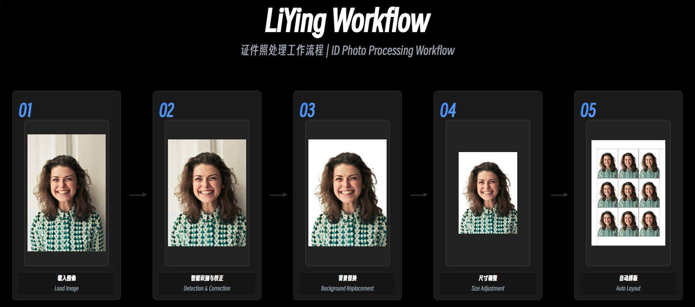
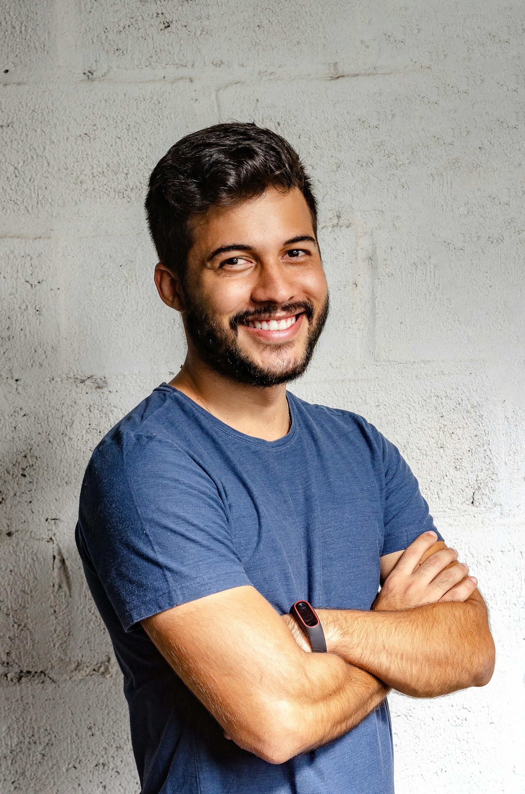
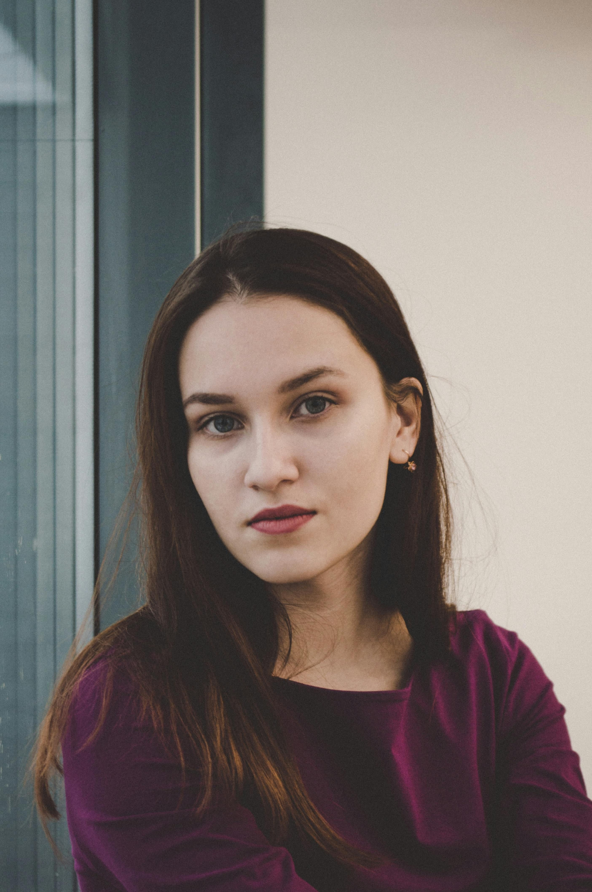

# LiYing

[简体中文](./README.md) | English

LiYing is an automated photo processing program designed for automating general post-processing workflows in photo studios.

## Introduction

LiYing can automatically identify human bodies and faces, correct angles, change background colors, crop passport photos to any size, and automatically arrange them.

LiYing can run completely offline. All image processing operations are performed locally.

### Simple Workflow Description



### Demonstration

|  |  |  |
| ----------------------------- | ---------------------------- | ---------------------------- |
| (1-inch on 5-inch photo paper - 3x3) | (2-inch on 5-inch photo paper - 2x2) | (1-inch on 6-inch photo paper - 4x2) |

**Note: This project is specifically for processing passport photos and may not work perfectly on any arbitrary image. The input images should be standard single-person portrait photos.**

**It is normal for unexpected results to occur if you use complex images to create passport photos.**

## Getting Started

### Bundled Package

If you are a Windows user and do not need to review the code, you can [download the bundled package](https://github.com/aoguai/LiYing/releases/latest) (tested on Windows 7 SP1 & Windows 10).  

The bundled package does not include any models. You can refer to the [Downloading the Required Models](https://github.com/aoguai/LiYing/blob/master/docs/README-EN.md#downloading-the-required-models) section for instructions on downloading the models and placing them in the correct directory.  

If you encounter issues while running the program, please first check the [Prerequisites](https://github.com/aoguai/LiYing/blob/master/docs/README-EN.md#prerequisites) section to ensure your environment is properly set up. If everything is fine, you can ignore this step.  

#### Running the bundled package  

Run the BAT script:  
```shell
cd LiYing
run.bat ./images/test1.jpg
```  

Run the WebUI interface:  
```shell
# Run WebUI
cd LiYing
run_webui.bat
# Open your browser and visit 127.0.0.1:7860
```

### Setup and Installation

You can install and configure LiYing locally by following the instructions below.

#### Prerequisites

LiYing depends on AGPicCompress, which in turn requires `mozjpeg` and `pngquant`.

You may need to manually install `pngquant`. Refer to the [official pngquant documentation](https://pngquant.org/) and add it to the appropriate location.

LiYing checks for `pngquant` in the following locations, which you can configure:
- Environment variables (recommended)
- LiYing/src directory
- `ext` directory under LiYing/src

This allows AGPicCompress to locate and use `pngquant` for PNG image compression.

##### Microsoft Visual C++ Redistributable Dependency

You need to install the latest [Microsoft Visual C++ Redistributable](https://learn.microsoft.com/en-us/cpp/windows/latest-supported-vc-redist).

If you are using Windows, your minimum version should be Windows 7 SP1 or higher.

#### Building from Source

You can obtain the LiYing project code by running:

```shell
git clone https://github.com/aoguai/LiYing
cd LiYing ## Enter the LiYing directory
pip install -r requirements.txt # Install Python helpers' dependencies
```

**Note: If you are using Windows 7, ensure you have at least Windows 7 SP1 and `onnxruntime==1.14.0, orjson==3.10.7, gradio==4.44.1`.**

#### Downloading the Required Models

Download the models used by the project and place them in `LiYing/src/model`, or specify the model paths in the command line.

| Purpose                   | Model Name        | Download Link                                                                                                         | Source                                                  |
|---------------------------|-------------------|----------------------------------------------------------------------------------------------------------------------|---------------------------------------------------------|
| Face Recognition          | Yunnet            | [Download Link](https://github.com/opencv/opencv_zoo/blob/main/models/face_detection_yunet/face_detection_yunet_2023mar.onnx) | [Yunnet](https://github.com/ShiqiYu/libfacedetection)  |
| Subject Recognition and Background Replacement | RMBG-1.4         | [Download Link](https://huggingface.co/briaai/RMBG-1.4/blob/main/onnx/model.onnx)                                           | [RMBG-1.4](https://huggingface.co/briaai/RMBG-1.4)     |
| Body Recognition          | yolov8n-pose      | [Download Link](https://github.com/ultralytics/assets/releases/download/v8.2.0/yolov8n-pose.pt)                           | [ultralytics](https://github.com/ultralytics/ultralytics) |

**Note: For the yolov8n-pose model, you need to export it to an ONNX model. Refer to the [official documentation](https://docs.ultralytics.com/integrations/onnx/) for instructions.**

We also provide pre-converted ONNX models that you can download and use directly:  

| Download Method  | Link  |  
|-----------------|--------------------------------------------------------------------------------|  
| Google Drive   | [Download Link](https://drive.google.com/file/d/1F8EQfwkeq4s-P2W4xQjD28c4rxPuX1R3/view) |  
| Baidu Netdisk  | [Download Link (Extraction Code: ahr9)](https://pan.baidu.com/s/1QhzW53vCbhkIzvrncRqJow?pwd=ahr9) |  
| GitHub Releases | [Download Link](https://github.com/aoguai/LiYing/releases/latest) |  

#### Running

```shell
# View CIL help
cd LiYing/src
python main.py --help
```

For Windows users, the project provides a batch script for convenience:

```shell
# Run BAT script
cd LiYing
run.bat ./images/test1.jpg
```

```shell
# Run WebUI
cd LiYing/src/webui
python app.py
```

#### CLI Parameters and Help

```shell
python main.py --help
Usage: main.py [OPTIONS] IMG_PATH

Options:
  -y, --yolov8-model-path PATH    Path to YOLOv8 model
  -u, --yunet-model-path PATH     Path to YuNet model
  -r, --rmbg-model-path PATH      Path to RMBG model
  -sz, --size-config PATH         Path to size configuration file
  -cl, --color-config PATH        Path to color configuration file
  -b, --rgb-list RGB_LIST         RGB channel values list (comma-separated)
                                  for image composition
  -s, --save-path PATH            Path to save the output image
  -p, --photo-type TEXT           Photo types
  -ps, --photo-sheet-size TEXT    Size of the photo sheet
  -c, --compress / --no-compress  Whether to compress the image
  -sv, --save-corrected / --no-save-corrected
                                  Whether to save the corrected image
  -bg, --change-background / --no-change-background
                                  Whether to change the background
  -sb, --save-background / --no-save-background
                                  Whether to save the image with changed
                                  background
  -lo, --layout-only              Only layout the photo without changing
                                  background
  -sr, --sheet-rows INTEGER       Number of rows in the photo sheet
  -sc, --sheet-cols INTEGER       Number of columns in the photo sheet
  -rt, --rotate / --no-rotate     Whether to rotate the photo by 90 degrees
  -rs, --resize / --no-resize     Whether to resize the image
  -svr, --save-resized / --no-save-resized
                                  Whether to save the resized image
  -al, --add-crop-lines / --no-add-crop-lines
                                  Add crop lines to the photo sheet
  -ts, --target-size INTEGER      Target file size in KB. When specified,
                                  ignores quality and size-range.
  -szr, --size-range SIZE_RANGE   File size range in KB as min,max (e.g.,
                                  10,20)
  -uc, --use-csv-size / --no-use-csv-size
                                  Whether to use file size limits from CSV
  --help                          Show this message and exit.

```

#### Configuration Files  

In this version, the `data` directory contains standard ID photo configuration files (`size_XX.csv`) and commonly used color configurations (`color_XX.csv`). You can modify, add, or remove configurations based on the provided CSV template format.

## Changelog  

**Note: This version includes changes to CIL parameters. Please carefully read the latest CIL help documentation to avoid issues.**  

- **2025/02/07 Update**  
  - **Added WebUI**  
  - Optimized configuration method by replacing INI files with CSV  
  - Added CI/CD for automated builds and testing  
  - Added options for layout-only photos and whether to add crop lines on the photo grid  
  - Improved fallback handling for non-face images  
  - Fixed known bugs  
  - Added and refined more photo sizes  

<details>  
  <summary>Previous Changelog</summary>  

- **2024/08/06 Update**
  - Added support for entering width and height in pixels directly for `photo-type` and `photo-sheet-size`, and support for configuration via `data.ini`.
  - Fixed issues related to some i18n configurations; now compatible with both English and Chinese settings.
  - Fixed other known bugs.
</details>


## Acknowledgments

The project was created to help my parents complete their work more easily. I would like to thank my parents for their support.

### Related Projects

Special thanks to the following projects and contributors for providing models and theories:

- [Yunnet](https://github.com/ShiqiYu/libfacedetection)
- [RMBG-1.4](https://huggingface.co/briaai/RMBG-1.4)
- [ultralytics](https://github.com/ultralytics/ultralytics)

You might also be interested in the image compression part, which is another open-source project of mine:

- [AGPicCompress](https://github.com/aoguai/AGPicCompress)

It depends on:

- [mozjpeg](https://github.com/mozilla/mozjpeg)
- [pngquant](https://github.com/kornelski/pngquant)
- [mozjpeg-lossless-optimization](https://github.com/wanadev/mozjpeg-lossless-optimization)

## Contribution

LiYing is an open-source project, and community participation is highly welcomed. To contribute to this project, please follow the [Contribution Guide](./CONTRIBUTING.md).

## License

[LiYing](https://github.com/aoguai/LiYing) is open-sourced under the AGPL-3.0 license. For details, please refer to the [LICENSE](../LICENSE) file.


## Star History

<a href="https://star-history.com/#aoguai/LiYing&Timeline">
  <picture>
    <source media="(prefers-color-scheme: dark)" srcset="https://api.star-history.com/svg?repos=aoguai/subscription&type=Timeline&theme=dark" />
    <source media="(prefers-color-scheme: light)" srcset="https://api.star-history.com/svg?repos=aoguai/subscription&type=Timeline" />
    
  </picture>
</a>
